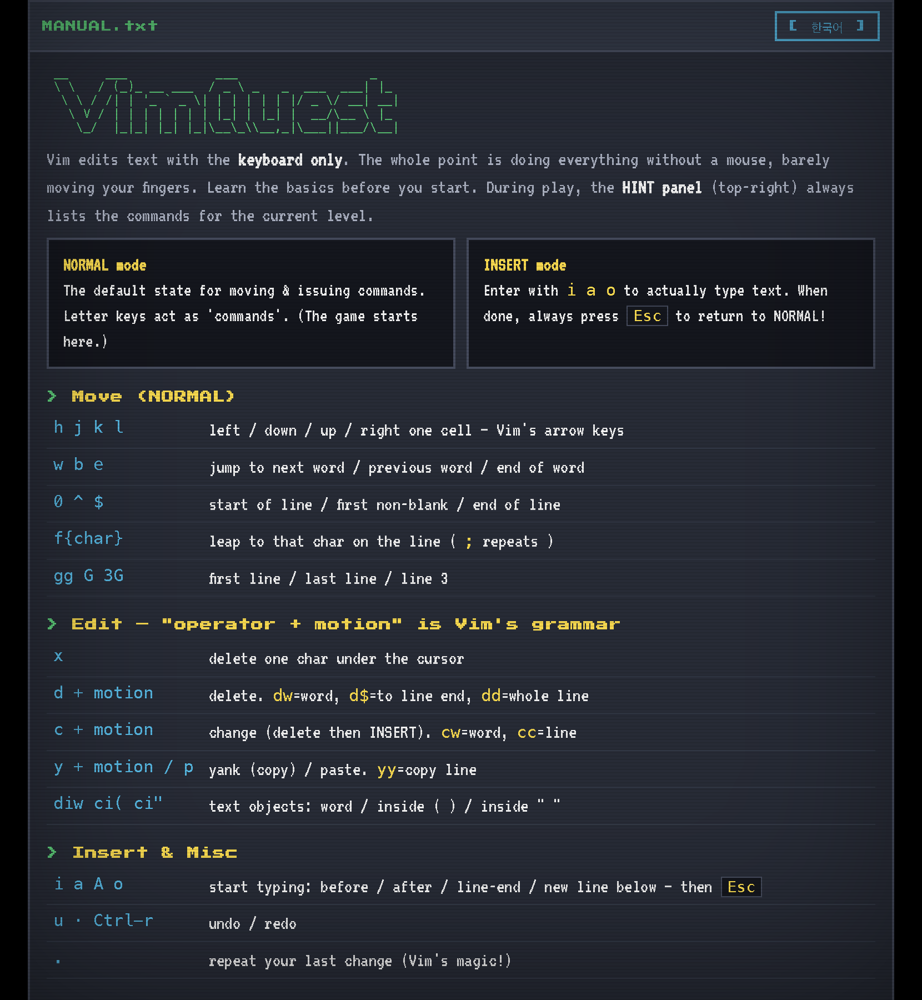

# VimQuest

Learn Vim by playing a text adventure game.



## Quick Start

### Requirements
- Go 1.26+
- Ebiten (for desktop): `go get github.com/hajimehoshi/ebiten/v2`
- TinyGo (for web): `brew install tinygo-org/tools/tinygo`

### Build & Run

```bash
make              # Build both desktop & web
make build-web    # Web (TinyGo WASM)
make build-desktop # Desktop (Ebiten)
make test         # Run tests (48 tests)
```

**Desktop:**
```bash
./vimquest
```

**Web:**
```bash
python3 -m http.server 8765 --directory web
# → http://localhost:8765/src/
```

## Architecture

- **cmd/** — Platform-specific entry points (desktop, web)
- **internal/engine/** — Pure Vim editor engine (no dependencies)
- **internal/game/** — Game rules & state machine
- **internal/store/** — Progress save (gob + base32 codec)
- **internal/platform/** — DOM/SFX bridge (web/no-op)
- **web/src/** — Static assets (HTML, JS, canvas renderer)

See [docs/ARCHITECTURE.md](docs/ARCHITECTURE.md) for full details.

## Development

See [docs/DEVELOPMENT.md](docs/DEVELOPMENT.md) for setup, testing, and common tasks.

## Commands Supported

### Movement
- `h j k l` — left/down/up/right
- `w b e` — next/prev word/end
- `0 ^ $` — line start/first char/end
- `gg G` — first/last line
- `f{x} t{x}` — jump to/before x

### Editing
- `d c y` — delete/change/yank + motion/object
- `x r s` — delete/replace/substitute char
- `i a o` — insert before/after/new line
- `u Ctrl-r` — undo/redo
- `.` — repeat last change

### Search
- `/` `?` — search forward/backward
- `n N` — repeat search

### Navigation Levels
- `:q` `:levels` — level select
- `:restart` `:e!` — restart level
- `:drill` — procedure generation mode
- `:help` — open manual

## License

MIT
