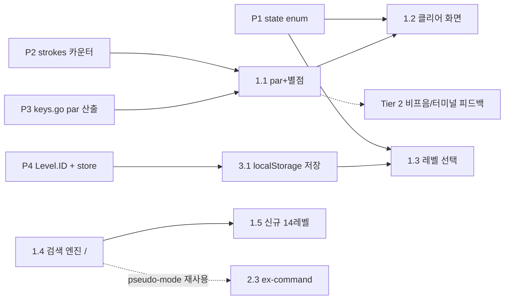

# VimQuest 개선 로드맵

> 작성일 2026-07-02 · 기준 커밋 `792e1db` (main)

MVP(4개 월드 19레벨) 이후, VimQuest를 **"Vim을 배우기에 더 유용하고, 더 재밌는" 게임**으로 발전시키기 위한 로드맵.

우선순위는 ① 학습 효과 ② 재미/게임 필 순이며, 공개 배포(GitHub Pages)는 후순위 Phase로만 기록한다.

관련 문서: 게임의 기본 설계는 [`GAME_DESIGN.md`](GAME_DESIGN.md) 참고.

### 디자인 원칙 — 레트로 감성과 Vim geek 무드 유지

모든 개선은 아래 원칙을 통과해야 한다. **화려한 게임이 아니라, 터미널 속에서 Vim을 만지는 기분**이 정체성이다.

1. **터미널이 낼 수 있는 것만 낸다** — 파티클·부드러운 애니메이션·트윈 같은 "요즘 게임" 연출 금지. 피드백은 문자(ASCII)·반전(inverse video)·비프음처럼 실제 터미널이 하던 방식으로.
2. **UI 자체가 Vim이다** — 메뉴 이동은 h/j/k/l, 메타 조작은 `:` ex-command, 상태 표시는 statusline. 게임 UI를 배우는 게 아니라 UI를 쓰는 것 자체가 Vim 연습이 되게 한다.
3. **숫자로 뽐내게 한다** — geek의 재미는 이펙트가 아니라 기록이다. par, 베스트 타수, 별점 같은 "골프 스코어"가 핵심 보상.
4. **게임 캔버스에 의존성·에셋 추가 금지** — 캔버스(WASM) 쪽은 폰트·이미지·오디오 파일 없이 코드로만. basicfont의 투박함도 컨셉이다. (웹 셸의 기존 Google Fonts(VT323, Press Start 2P)는 현행 유지 — 이 원칙은 게임 캔버스에 한정한다.)

---

## 1. 현재 상태 요약

### 구현된 것

| 영역 | 내용 |
|---|---|
| 레벨 | 19개 (navigate 8 + edit 11), 4개 월드: W1 기본 이동 → W2 빠른 이동 → W3 오퍼레이터/Insert → W4 텍스트 객체 |
| Vim 엔진 (editor.go, ~1,430줄) | Normal/Insert/Visual/Visual-Line, 모션 `h j k l 0 ^ $ w b e W B E f F t T ; , gg G`, 오퍼레이터 `d c y`(+모션/+텍스트객체/중복형) + count, `x X r s S D C p P`, `i a o O A I`, `u`/`Ctrl-r`, `.` 반복, 텍스트객체 `iw aw i" a" i' a' i( ib i{ i[ i<` 등 |
| 테스트 | 15개 전부 통과 — editor_test.go 11개(엔진 단위) + main_test.go 4개(레벨 검증). edit 레벨은 `TestEditLevelsSolvable`이 `Solution` 시퀀스로 자동 풀이 검증 |
| UI | 레트로 터미널 웹 UI(web/index.html), 한국어/영어 매뉴얼, 치트시트(`Ctrl+/`), HINT 패널 |

### 빠진 것

| 공백 | 왜 문제인가 |
|---|---|
| **점수/효율 피드백 없음** | "목표 도달"만 판정하고 몇 타에 도달했는지 안 봄. edit 레벨엔 검증된 `Solution`(levels.go)이 이미 있어 **par(기준 타수)를 공짜로 산출 가능**한데 미활용 — 진짜 Vim 실력(효율적 도달)을 가르칠 최대 기회 |
| 엔진이 지원하지만 안 가르치는 기능 | visual 모드, count(`3x`, `d2w`), `F/T/t`, `p` vs `P`, `u`/`Ctrl-r` — **레벨만 추가하면 됨** |
| 검색(`/`) 부재 | 커리큘럼과 엔진 양쪽에 없음. 실전 Vim의 핵심 이동 수단이라 신규 구현 필요 |
| 진행 저장 없음 | 새로고침하면 1-1부터 다시. 레벨 선택 화면도 없어 재도전 불가 |
| 클리어 연출 없음 | `advance()`가 즉시 다음 레벨을 로드 — 성취감·복기 기회 없음 |
| 게임 필 | 피드백 전무 — 비프음도, 터미널식 반응(visual bell 등)도 없음 |

---

## 2. 아키텍처 선행 작업 (P1–P4)

이후 모든 기능의 토대가 되는 소규모 리팩터링. 전부 main.go 중심.

### P1. 게임 상태 머신 — `S`

`Game.finished bool`(main.go)을 `state` enum으로 교체:

```go
type gameState int
const (
    statePlaying gameState = iota
    stateLevelClear  // 레벨 클리어 요약 화면
    stateLevelSelect // 레벨 선택 화면
    stateAllClear    // 전체 클리어
)
```

핵심 변경점은 `advance()` — 지금은 즉시 `loadLevel(idx+1)`을 호출하지만, `stateLevelClear`로 전환하도록 바꾼다. `Update()`/`Draw()`는 state에 따라 분기. edit 레벨의 `checkWin()` 완전일치 판정 특성상 **`advance()` 한 곳만 고치면 되는** 구조라 리스크가 작다.

### P2. 키스트로크 카운터 — `S`

`Game.strokes int`를 `feed()`(main.go) 입구에서 증가시키고 `loadLevel()`에서 리셋. navigate 레벨에서 `navigateAllows`에 막힌 키도 **카운트한다**(VimGolf 방식 — 잘못 누른 키도 타수).

### P3. 키 시퀀스 파서 승격 + par 산출 — `S`

editor_test.go의 `feedKeys()`가 가진 `<esc> <cr> <bs> <c-r>` 토큰 파서를 프로덕션 코드 `keys.go`의 `parseKeys(s string) []Key`로 승격.

```
par = len(parseKeys(lv.Solution))   // 특수키 1토큰 = 1타
```

동시에 navigate 레벨 8개에도 `Solution`을 추가한다(예: 1-1 `"jjllllkkjj..."` 류의 검증된 경로). 부수효과로 navigate 레벨도 자동 풀이 검증 테스트(`TestNavigateLevelsSolvable`)를 얻는다 — 지금은 맵 구조만 검증하고 풀이 가능성은 안 본다.

### P4. Level.ID + 저장 스키마 — `S`

- `Level.ID string` 필드 추가 (`"1-1"`, `"3-4"` 등 — 현재 Title 접두어와 동일).
- localStorage 스키마 `vimquest.v1`: 레벨별 `{unlocked, bestStrokes, stars}`.
- 저장소 접근은 기존 `domSet` 패턴을 따라 빌드 태그로 분리한 store 인터페이스로: `store_js.go`(syscall/js → localStorage) / `store_other.go`(no-op 또는 메모리) — dom_js.go/dom_other.go와 같은 방식이라 데스크톱 빌드·테스트가 깨지지 않는다.

---

## 3. Tier 1 — 학습 효과 (최우선)

### 1.1 par 점수 + 별점 — `M` (main.go, levels.go)

- 별점: **3★ = par 이내 · 2★ = par×1.5 이내 · 1★ = 클리어**.
- 하단 상태바에 실시간 표시: `keys 12 / par 8`. 기존 상태바(`ModeName` + `pendingStr` + `lastKey`)에 한 칸 추가.
- P2(strokes) + P3(par)만 있으면 되므로 Phase 1에서 가장 먼저 체감되는 기능.

### 1.2 레벨 클리어 요약 화면 — `M` (main.go)

`stateLevelClear`에서 캔버스 렌더:

```
┌──────────────────────────────┐
│  LEVEL 3-3 CLEAR!            │
│  your keys : 5               │
│  par       : 3   ★★☆        │
│  best      : 4 → 3 (NEW!)    │
│  [Enter] next   [r] retry    │
└──────────────────────────────┘
```

- **Enter 즉시 스킵 가능**(속도감 유지), `r`로 같은 레벨 재도전 → par 도전 루프가 생긴다.
- geek 보상: **3★ 달성 시 제작자 솔루션(`Solution`) 공개** — VimGolf처럼 "내 답 vs 최적해"를 비교하는 재미. 달성 전엔 숨겨서 스포일러 방지.

### 1.3 레벨 선택 화면 — `M` (main.go)

- `stateLevelSelect`에서 월드×레벨 그리드를 캔버스로 렌더.
- **커서 이동을 h/j/k/l로** — 메뉴 조작 자체가 Vim 연습. `Enter`로 입장, `Esc`로 복귀.
- 레벨별 별(☆☆☆~★★★)/잠금 표시. 잠금 해제 정보는 P4 store에서.

### 1.4 검색 엔진 구현: `/ ? n N` — `M` (editor.go, ~120줄 + 테스트)

- 별도 Mode를 추가하기보다 pseudo-mode로: `searching bool` 플래그 + 입력을 `feedSearch()`로 라우팅. `<cr>`로 확정, `<esc>`로 취소, `<bs>`로 한 글자 삭제.
- 입력 중 문자열은 기존 `pendingStr`로 상태바에 `/foo` 형태로 표시(이미 렌더 경로가 있음).
- `n`/`N` 반복, `?` 역방향. 매치 하이라이트는 선택(가능하면 `colMatch` 재활용).
- editor_test.go에 `/target<cr>` → 커서 위치 검증 테스트 추가.

### 1.5 신규 4개 월드 ~14레벨 — `L` (levels.go)

엔진이 이미 지원하는(또는 1.4로 추가된) 기능을 커리큘럼에 편입. 기존 `TestEditLevelsSolvable` 하네스가 `Solution`만 적으면 자동 검증한다.

| 월드 | 가르치는 것 | 레벨 수 (안) |
|---|---|---|
| W5 Search Swamp | `/`, `n`, `?` — 긴 맵/버퍼에서 검색으로 즉시 이동 | 3 |
| W6 Precision Peaks | count(`3w`, `d2w`, `3x`), `F/T/t`, `;`/`,` 조합 | 4 |
| W7 Visual Valley | `v`/`V` 선택 후 `d`/`y`, `viw` 등 텍스트객체 결합 | 3 |
| W8 Yank & Undo Ruins | `xp`(글자 교환), `ddp`(줄 교환), `P` vs `p`, `u`/`Ctrl-r` | 4 |

navigate형 레벨에서 새 명령을 쓰려면 `navigateAllows`(main.go) 허용 목록 확장 필요(`/`, `n`, `N`, `;` 등).

---

## 4. Tier 2 — 재미/게임 필 (레트로·geek 한정)

디자인 원칙에 따라 **파티클·화면 플래시·커서 트레일 같은 그래픽 연출은 하지 않는다.** 피드백은 전부 터미널 어법(문자, 반전, 비프음, ex-command)으로 낸다.

### 2.1 칩튠 비프음 — `S` (web/index.html, dom_js.go)

- 사각파(square) 신스 ~40줄을 index.html에 인라인 — **에셋 파일 불필요**, PC 스피커 비프음 감성.
- 이벤트: 열쇠 수집(띠링↑), 버그 처치(뿅), 막힌 키(짧은 버즈 — 터미널 bell), 레벨 클리어(2~3음 짧은 지글). 과한 팡파레 금지, 전부 0.1초 안팎.
- Go → JS 브리지 `jsSfx(name)`을 `registerJSHooks` 패턴으로 추가. 음소거 토글 제공.
- AudioContext는 브라우저 제스처 요건 때문에 **인트로의 START GAME 버튼 클릭에서 init**.

### 2.2 터미널식 피드백 (visual bell + ASCII) — `S` (main.go, ~40줄)

터미널이 실제로 하던 것만 한다:

- **visual bell**: 막힌 키 입력 시 1~2프레임 화면(또는 상태바) 반전 — 실제 Vim의 `:set visualbell`과 동일한 어법.
- **ASCII 사망 연출**: 버그(`*`) 처치 시 몇 프레임 동안 `x` 문자로 바뀌었다 사라짐. 열쇠 획득 시 해당 칸을 잠깐 반전. 파티클이 아니라 **문자 치환**으로.
- 구현은 `Game`에 `{row, col, glyph, ttl}` 몇 개짜리 슬라이스면 충분 — 기존 `drawChar`/`drawRect` 재활용.

### 2.3 `:` ex-command 라인 — `M` (main.go)

geek 무드의 핵심 기능. HTML 버튼 대신 **Vim처럼 `:` 명령으로 메타 조작**한다:

- `:q` 레벨 선택으로 나가기 · `:restart`(또는 `:e!`) 레벨 재시작 · `:help` 매뉴얼 · `:levels` 레벨 선택 · **`:{N}` 줄 점프**(`:5` = `5G`, 파서에 숫자 분기 하나면 되고 W2에서 배운 `{N}G` 복습 효과).
- Normal 모드에서 `:` 입력 시 하단 상태바가 명령줄이 됨 — 1.4 검색의 pseudo-mode(`searching` 플래그 + `pendingStr` 표시)와 같은 구조를 재사용하므로 추가 비용이 작다.
- 기존 Reset/Restart HTML 버튼은 유지하되, ex-command가 정식 경로 — 게임을 하다 보면 `:q`가 손에 붙는다.

### 2.4 힌트 타자기 효과 — `S` (web/index.html, dom_js.go)

- 옛날 터미널의 문자 단위 출력 감성. index.html에 MutationObserver로 `#hint` 변경을 감지해 타자기 출력.
- **전제: `domSet`에 값 dedupe 가드 필수** — 현재 `syncDOM()`이 매 프레임 호출되어 같은 값을 계속 쓰므로, "이전 값과 같으면 skip"을 넣지 않으면 타자기가 매 프레임 리셋된다. (이 가드는 그 자체로 매 프레임 DOM 갱신 낭비도 해결.)

### 2.5 CRT 오버레이 (선택) — `S` (web/index.html, CSS만)

- CSS `repeating-linear-gradient` 스캔라인 + 미세한 초록/앰버 글로우. 코드 몇 줄이라 부담 없고, 취향을 타므로 **토글 가능하게**. 과하면 빼는 쪽이 기본값.

---

## 5. Tier 3 — 품질/인프라

배포는 사용자 결정에 따라 **"나중에"** — 3.2는 후순위로만 기록.

- **3.1 localStorage 진행 저장** — `S`. P4 store 연결: 클리어 시 `{unlocked, bestStrokes, stars}` 저장, 시작 시 복원. 새로고침해도 이어하기.
- **3.2 (후순위) GitHub Pages + CI** — `S`. `go test` + build.sh를 GitHub Actions로, web/을 Pages 배포. build.sh에 `-ldflags="-s -w" -trimpath` 추가로 wasm 용량 절감. TinyGo는 Ebiten 호환성 문제로 **제외**.
- **3.3 매뉴얼 재열기 버튼** — `S`. 현재 intro(MANUAL.txt)는 닫으면 다시 못 연다. 우측 패널에 버튼 추가.
- **3.4 치트시트 KO/EN 토글** — `S`. 매뉴얼은 이미 토글이 있으나 치트시트는 EN 전용.
- **3.5 파비콘** — `S`. 터미널 느낌의 픽셀 파비콘.
- **3.6 데드코드 정리** — `S`. editor.go의 `_ = r`, `_ = count` 등 미사용 잔재 제거.

---

## 6. Phase 순서

의존 관계:



### Phase 1 — 메타게임 루프 (한 세션 분량)

신규 레벨 없이 **기존 19레벨의 재플레이 가치와 학습 밀도를 극대화**한다.

| 순서 | 항목 | 파일 | 규모 |
|---|---|---|---|
| 1 | P1 state enum | main.go | S |
| 2 | P2 strokes 카운터 | main.go | S |
| 3 | P3 parseKeys/par + navigate Solution | keys.go(신규), editor_test.go, levels.go, main_test.go | S |
| 4 | 1.1 par + 별점 + 상태바 | main.go | M |
| 5 | 1.2 클리어 요약 화면 | main.go | M |
| 6 | P4 + 3.1 저장 | levels.go, store_js.go(신규), store_other.go(신규), main.go | S |
| 7 | 1.3 레벨 선택 화면 | main.go | M |
| 8 | 3.3 매뉴얼 재열기 | web/index.html | S |
| 9 | 3.6 데드코드 정리 | editor.go | S |

**완료 기준 (Definition of Done):**
- `go test ./...` 전부 통과 — 신규 `TestNavigateLevelsSolvable` 포함.
- 모든 레벨에서 상태바에 `keys N / par M` 실시간 표시.
- 클리어 화면에서 `Enter` 즉시 진행, `r` 재도전 동작.
- 새로고침 후 진행 상황·별점이 localStorage에서 복원됨.
- 레벨 선택 화면에서 h/j/k/l 이동·`Enter` 입장·잠금 표시 확인.

### Phase 2 — 콘텐츠 (커리큘럼 2배)

| 순서 | 항목 | 파일 | 규모 |
|---|---|---|---|
| 1 | 1.4 검색 엔진 `/ ? n N` | editor.go, editor_test.go | M |
| 2 | `navigateAllows` 확장 | main.go | S |
| 3 | 1.5 신규 4개 월드 ~14레벨 | levels.go | L |

**완료 기준 (Definition of Done):**
- 검색 단위 테스트 통과 — `/target<cr>` 커서 이동, `n`/`N` 반복, `?` 역방향, `<esc>` 취소.
- 신규 14레벨 전부 `TestEditLevelsSolvable`/`TestNavigateLevelsSolvable` 자동 검증 통과.
- W5 navigate 레벨에서 `/`·`n`이 `navigateAllows`를 통과하는지 수동 확인.

### Phase 3 — 필 + 배포

| 순서 | 항목 | 파일 | 규모 |
|---|---|---|---|
| 1 | 2.1 칩튠 비프음 | web/index.html, dom_js.go | S |
| 2 | 2.2 터미널식 피드백 (visual bell + ASCII) | main.go | S |
| 3 | 2.3 `:` ex-command 라인 | main.go | M |
| 4 | 2.4 타자기 힌트 (+domSet dedupe) | web/index.html, dom_js.go | S |
| 5 | (2.5 CRT 오버레이 — 선택, 토글) | web/index.html | S |
| 6 | 3.2 GitHub Pages + CI | .github/workflows(신규), build.sh | S |
| 7 | 3.4 치트시트 토글 / 3.5 파비콘 | web/index.html | S |

**완료 기준 (Definition of Done):**
- 음소거 토글 동작, 효과음은 START GAME 클릭 이후에만 재생(AudioContext 제스처 요건).
- visual bell이 **막힌 키에서만** 발동하고 정상 입력에선 발동하지 않음.
- `:q` / `:restart` / `:help` / `:levels` / `:{N}` 전부 동작.
- 타자기 효과가 프레임 리셋 없이 힌트 변경 시 1회만 출력(domSet dedupe 확인).

---

## 7. 리스크 / 노트

- **연출 과잉이 최대 리스크** — 각 Tier 2 항목은 "실제 터미널/Vim이 하던 방식인가?"를 통과 못 하면 버린다. 파티클·트윈·커서 트레일은 이 기준으로 이미 기각.
- **basicfont 2x의 투박함은 레트로 컨셉으로 수용** — 캔버스 폰트 추가 금지(wasm 용량·컨셉 일관성).
- **클리어 화면은 Enter 즉시 스킵** — 템포를 죽이면 오히려 역효과. 연출은 짧고 스킵 가능하게.
- **ex-command(2.3)와 검색(1.4)은 같은 pseudo-mode 골격 공유** — 1.4를 먼저 구현하면 2.3은 라우팅 분기 추가 수준. 순서를 지킬 것.
- **typewriter(2.4)는 domSet dedupe가 전제** — 없으면 매 프레임 리셋으로 아예 동작 불가.
- **한글 IME 입력 유실** — 검색(`/foo`) 패턴 입력과 insert 모드 타이핑은 한글 IME가 켜져 있으면 keyCode 229로 키가 유실된다. 기존 IME 경고 배너를 **검색/삽입 모드 진입 시에도** 노출하도록 확장할 것(1.4·2.3 구현 시 함께 처리).
- **par 산정의 공정성**: `Solution`이 최적해가 아닐 수 있다. par는 "제작자 기준 타수"로 명시하고, 별점 커트라인(×1.5)에 여유를 둔다. 커뮤니티 최적해 발견 시 `Solution`만 갱신하면 테스트·par가 함께 따라온다.
- **navigate Solution 추가 시** 맵을 수정하면 Solution도 깨진다 — `TestNavigateLevelsSolvable`이 이를 잡아주는 안전망이 된다(의도된 부수효과).
- 검색(1.4)은 pseudo-mode라 기존 `Feed()` 상태 머신(`await`/`op`/`pendObj`)과 충돌하지 않도록 **searching 분기를 Feed 최상단에서** 처리한다.

---

## 8. 백로그

### 기각 (디자인 원칙 위배 — 다시 제안하지 말 것)

- 파티클, 커서 트레일, 화면 플래시 등 그래픽 연출 (→ 원칙 1, 2.2의 문자 치환·visual bell로 대체)
- 오디오 에셋 파일 (→ 2.1 인라인 WebAudio 신스로 대체)
- 게임 캔버스 폰트 추가 (→ 원칙 4, basicfont 고수)
- TinyGo 빌드 (→ Ebiten 호환성 문제)

### 미래 아이디어 (이번 로드맵 제외, 필요 시 재검토)

- **샌드박스 자유 연습 모드** — `:new`로 빈 버퍼를 열어 배운 명령을 자유롭게 실험
- **내 풀이 공유** — 클리어한 키 시퀀스를 클립보드로 복사(VimGolf식 풀이 공유 문화)
- **매크로 `q`/`@`** — 엔진 신규 구현 필요, 고급 커리큘럼(W9?) 후보
- **모바일/터치 지원** — 하드웨어 키보드 전제라 근본 재설계 필요
- **리더보드·계정·클라우드 저장** — GAME_DESIGN.md에서도 MVP 제외로 명시된 항목
